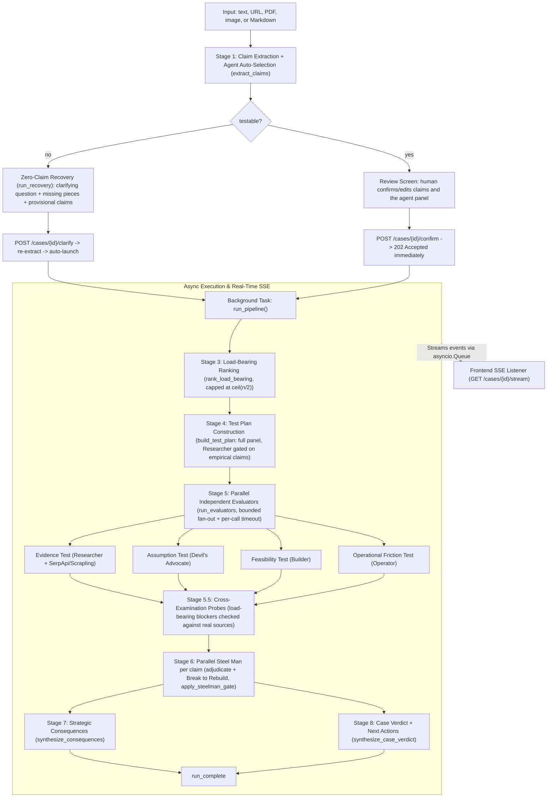

# Crossfire Backend Pipeline — Pitch & Architecture Guide

---

## 1. The Pitch Hook: The Core Thesis

> **"Don't ask AI whether your idea is good. Make it survive a crash test."**

Standard LLMs are eager-to-please sycophants—ask them about a startup idea, business venture, or strategic pivot, and they generate three polite paragraphs telling you it's brilliant.

**Crossfire does the opposite:** it compiles fuzzy human intent into **discrete, falsifiable claims**, identifies which ones are **load-bearing**, and runs **independent adversarial tests** grounded in live web evidence to see what survives, what breaks, and what you must change before committing real time or money.

---

## 2. Pipeline Flow Diagram

Stages 7 and 8 run concurrently under one `asyncio.gather()` — the memo copy and the decision state do not depend on each other.

---

## 3. The Pipeline Lifecycle

### Stage 1: Claim Decomposition and Agent Auto-Selection (`extract_claims`)
* **Location:** [`core/loop.py`](backend/core/loop.py), [`core/agent_panel.py`](backend/core/agent_panel.py)
* **What happens:** At `POST /cases` the model gives no advice. `extract_claims()` breaks the proposal into at most 5 discrete, atomic assertions (each a `Claim`). Input can be raw text or an ingested document — dedicated `POST /ingest/url`, `/ingest/pdf`, `/ingest/image`, and `/ingest/markdown` endpoints produce the `context` field.
* **Agent auto-selection:** in `auto` mode the same model that just read the decision also picks which evaluators the case needs, with a one-sentence rationale per pick (`selected_agents`, `agent_rationales`). There is **no keyword table** — keyword routing can only encode scenarios someone thought of in advance, and identical words mean different things across domains. `custom` mode lets the user pin the panel manually.
* **Pitch Value:** *"We don't test vague vibes; we test atomic propositions that can independently prove true or false — and the panel of tests is chosen per decision, not by a static rulebook."*

### Stage 1b: Zero-Claim Recovery — the input gate that answers back
* **Location:** [`core/recovery.py`](backend/core/recovery.py), `POST /cases/{id}/clarify`
* **What happens:** If the extractor reports the input is not testable (or yields no statements), the case returns `status="needs_input"` — but it does not stop at a generic redirect. A second pass (`run_recovery`) returns four things:
  1. `clarifying_question` — one question a curious colleague would actually ask, referencing the user's own words. "Please rephrase" and "invalid input" are explicitly banned.
  2. `clarify_missing` — 2–3 fragments naming the concrete absent pieces (the option, the cost, the deadline, the alternative).
  3. `clarify_interpretation` — an optional *"Reading it as: …"* so the user can correct a misreading instead of guessing at it.
  4. `provisional_claims` — at most 3 claims, each traceable to words in the input, with **no invented numbers, dates, prices, vendors, jurisdictions or statistics**. An honest empty list beats a fabricated claim.
* **Provisional claims are marked, not trusted.** `confirm` rejects a case while any claim still carries `provisional=True` — the user must confirm or delete them first, so an inferred claim never silently becomes a tested one.
* **`POST /cases/{id}/clarify`** merges the user's answer with the original input, re-extracts, and — if claims now exist — **launches the pipeline automatically** (`auto_started: true`) rather than bouncing the user back to a confirm screen. A second failed round asks about something different: the previous question is passed back in so the model cannot loop.
* **Pitch Value:** *"An unusable input doesn't get an error message. It gets the question a good analyst would have asked, and the run starts the moment you answer it."*

### Stage 2: Human Confirmation & The Decoupled Event Queue
* **Location:** [`api/routes.py`](backend/api/routes.py), [`events.py`](backend/events.py)
* **What happens:**
  1. The user reviews and edits the claims — and the selected agent panel — before any compute is burned.
  2. "Confirm" calls `POST /cases/{id}/confirm`. The backend **does not block** for the run; it schedules `run_pipeline` via `asyncio.create_task()` (tasks are held in a strong-reference set so the event loop cannot garbage-collect a run mid-flight) and returns `202 Accepted` in **<50ms**.
  3. Every step publishes to a per-case `asyncio.Queue` streamed to the browser over SSE (`GET /cases/{id}/stream`, with a 15s keep-alive ping): `claim_map_ready`, `needs_input`, `load_bearing_ready`, `test_started`, `finding_ready`, `verdict_ready` (the verdict plus `fatal_flaw` / `salvaged_claim` / `tradeoff_acknowledged` / `missing_input` / `salvage_scope` / `weakened_kind`), `consequence_ready`, `case_verdict`, `run_complete`, plus `activity` narration events (`emit_activity`) so the user watches the reasoning happen instead of a spinner.
* **Pitch Value:** *"Zero race conditions. Even if network latency delays the listener attachment, events buffer safely so no telemetry or verdict is lost. And any provider failure closes the stream with an `error` event rather than hanging it open."*

### Stage 3: Load-Bearing Ranking (Adaptive Compute)
* **Location:** [`core/loop.py`](backend/core/loop.py) — `rank_load_bearing`, `load_bearing_cap`
* **What happens:** The pipeline asks one ruthless question per claim:
  > *"If this claim turns out false, would the recommended decision materially change?"*

  Rather than flagging each claim in isolation, the model **ranks** them, and at most `ceil(n/2)` come back load-bearing. Asked one claim at a time a model says yes to everything, and adaptive scrutiny stops existing. On provider failure it degrades to the top half by original order, so a run always differentiates instead of flattening.
* **What the flag actually buys:** deep-fetch eligibility inside the Researcher, eligibility for a cross-examination probe, consequence impact weighting, and the claim set the final decision-state ladder reads.
* **Pitch Value:** *"Not all claims matter equally. If 'the UI needs dark mode' is false, you still launch. If 'users will legally allow automated visa filing' is false, your company is dead. We isolate the load-bearing pillars and spend our expensive retrieval exclusively there."*

### Stage 4: Test Plan Routing
* **Location:** [`core/agent_panel.py`](backend/core/agent_panel.py) — `build_test_plan`, `is_empirical_claim`; [`core/evaluators/__init__.py`](backend/core/evaluators/__init__.py) — `dispatch`
* **What happens:** One agent, one failure mode — the whole routing table:

  | Agent | Failure mode | UI name |
  |---|---|---|
  | `researcher` | `evidence` | Evidence Test |
  | `devils_advocate` | `assumption` | Assumption Test |
  | `builder` | `feasibility` | Feasibility Test |
  | `operator` | `operational_friction` | Operational Friction Test |

  **Every claim gets the full active panel.** Single-evaluator routing for secondary claims was removed: one persona per claim meant one blind spot per claim, and the cheapest way to miss the thing that kills a decision is to only ask about one dimension of it. The panel narrows on *evidence availability*, not on claim importance — `is_empirical_claim()` drops the Researcher from claims with nothing checkable against the world, because searching a pure value judgement returns noise that then has to be argued about.

  `dispatch()` maps failure mode to evaluator, and **the Researcher is the fallback** for unrecognised modes. Every Researcher path returns a Finding and its zero-evidence path *abstains* (`confidence=0.0`), so a misrouted claim degrades into a search attempt rather than inheriting the harshest evidence-free objection in the panel. Legacy aliases (`edge-case`, `behavior`, `constraint`, `alternative`, `adoption`, `bureaucracy`) still route, so a stored plan from an older run replays cleanly, and the `overthinker` name normalizes to `operator` at the API boundary.

### Stage 5: Independent Adversarial Evaluation
* **Location:** [`core/evaluators/`](backend/core/evaluators/) — `researcher.py`, `devils_advocate.py`, `builder.py`, `operator.py`
* **What happens:**
  * **Strict independence:** evaluators execute concurrently via `asyncio.gather()` against an *isolated copy of the case* with findings, consequences and verdict stripped — no evaluator can see another evaluator's output even by accident. Fan-out is bounded by a semaphore (`EVALUATOR_CONCURRENCY`, default 8) and each call by a timeout (`EVALUATOR_TIMEOUT_SECONDS`, default 60s), so one hung provider connection cannot hold a run open. An evaluator that raises or times out becomes a low-confidence *degraded finding* rather than taking down the run.
  * **One shared confidence scale.** `confidence` on every Finding means **objection strength** — how hard this finding argues *against* the claim — never "how sure am I of my analysis." Certainty is unrankable across personas (a Researcher certain the claim is *fine* would outrank a Builder holding a hard blocker); objection strength is comparable, which is what makes `rank_findings` and the adjudication meaningful. The 0.0–0.1 "no objection" band is load-bearing on its own: without a way to say *nothing here*, a persona invents friction to fill the field.
  * **Masked personas:** internal agent names are masked as objective test names in the UI:
    - `devils_advocate` → **Assumption Test** (unstated premises and counter-incentives).
    - `researcher` → **Evidence Test** (live web data via [`evidence/search.py`](backend/evidence/search.py)).
    - `builder` → **Feasibility Test** (technical constraints, latency, permissions, integration limits, threat model, MVP bifurcation).
    - `operator` → **Operational Friction Test** (adoption inertia, enterprise gatekeeping and procurement, regulatory liability, process drag). *This replaced the former "Overthinker / Edge-Case Test": generic tail-risk brainstorming produced findings nobody could act on, while organizational friction is where real decisions actually die. `run_overthinker` remains as a backward-compatible alias.*
  * **The Researcher's evidence engine:**
    1. Query construction is adversarial by design — `build_query`, `build_adversarial_query`, `build_authority_query`, `build_competitor_query`, and an LLM `reformulate_query` pass when the first search returns nothing usable.
    2. Search — **SerpApi when `SERPAPI_API_KEY` is set, with automatic fallback to DuckDuckGo Lite via Scrapling** on HTTP 429 or a missing key. Every `EvidenceItem` records its `provider` and a `source_class` (primary, institutional, press, community, blog), and results are re-ranked by source class.
    3. If the claim is **load-bearing** and the snippet is thin, fire **Scrapling** ([`evidence/fetch.py`](backend/evidence/fetch.py)) to deep-fetch the full page.
    4. Curate down to 1–3 dense, fact-checking sentences ([`evidence/curate.py`](backend/evidence/curate.py)); evidence the model never cited is kept as unstanced context rather than presented as support.
    5. Structural rule: **a negative finding without evidence is never a confident negative.** With no evidence, confidence is capped and `contradiction` stays null.

### Stage 5.5: Cross-Examination — checking the panel's own blockers
* **Location:** [`core/cross_examination.py`](backend/core/cross_examination.py) — `run_cross_examination_probes`, `extract_critical_blocker`, `probe_blocker`
* **The problem it solves:** Builder and Devil's Advocate reason without retrieval. Their strongest objections — a rate limit, a permission model, a regulation, a unit cost — are *hypotheses stated with confidence*, and under the evidence gate they could only ever weaken a claim, no matter how right they were.
* **What happens:** for each **load-bearing** claim where the panel raised a hard blocker and the Researcher did **not** already return a sourced contradiction, Crossfire extracts that blocker, runs a targeted authority search on it, and asks one question of the retrieved sources: what do they actually establish?
  * `contradicts` — a source states something the claim cannot survive, quoted **in the source's own terms**, never a restatement of the evaluator's blocker text. This is the one path that produces a probe finding capable of breaking a claim.
  * `supports` — the sources show the claim holds on that dimension.
  * `context` — the sources are about the right subject and settle nothing. The prompt names this the honest answer most of the time and tells the model to use it. A `contradicts` stance that fails to name a contradiction is demoted to `context` and capped in code.
* The probe returns as a normal `researcher` Finding, streamed as `finding_ready`. A failure here is logged and skipped — the run proceeds on the original findings.
* **Pitch Value:** *"A theoretical objection gets one chance to become a fact. We take the panel's hardest blocker, go looking for a source that confirms it, and let the source decide — which mostly means the objection stays an objection."*

### Stage 6: The Steel Man — Adjudication, then Re-Architecture (No Voting!)
* **Location:** [`core/reconcile.py`](backend/core/reconcile.py) — `reconcile`, `apply_evidence_gate`, `apply_steelman_gate`, `classify_weakened`, `rank_findings`
* **What happens:** In other multi-agent systems, agents "vote" by majority rule. Crossfire runs a single persona — the **Steel Man**, which is both Supreme Adjudicator and Principal Solutions Architect — **per claim, in parallel** (bounded by `STEELMAN_CONCURRENCY`, default 3, so a burst of judge calls does not queue behind itself upstream), in two phases.

  **Phase 1 — Adjudication.** Judged strictly on evidence quality, never on a tally:
  * **Strict anti-voting:** confidence scores are never averaged. One grounded fact from the Researcher outweighs three speculative objections from the rest of the panel.
  * **The evidence gate, in both directions.** Downward: a `broken` verdict requires at least one finding carrying *both* evidence and an explicit contradiction traceable to a source (`has_sourced_contradiction`) — reasoning-only evaluators can weaken a claim, never break it, and a `broken` verdict without a source is auto-downgraded to `weakened` with the downgrade written into the reasoning. Upward: a panel whose every objection sits under the trivial ceiling (0.2) has not weakened anything, whatever word the judge reached for.
  * **Findings are ranked** (`rank_findings`) so the drawer leads with the finding that actually moved the verdict, not whichever evaluator returned first.
  * Every claim lands on one of **four strict verdicts** — `survived`, `weakened`, `broken`, `unresolved` — and a `weakened` claim is further split by `classify_weakened()` into **`qualified`** (holds with caveats) or **`contested`** (a sourced contradiction, a redesign-scope salvage, or an objection at or above 0.4). The confidence number shown in the UI is derived from that pair, not generated: survived 0.90–0.98, qualified 0.60–0.75, contested 0.35–0.55, broken 0.05–0.15, unresolved a flat 0.50.

  **Phase 2 — Break to Rebuild (mandatory mitigation).** A `weakened` or `broken` verdict may not simply reject the claim. The Steel Man must isolate the `fatal_flaw`, return the minimal viable fix as a `salvaged_claim`, state the `tradeoff_acknowledged` that fix costs, and tag the fix's `salvage_scope`:
  * **`parameter`** — same decision, different setting. The decision survives.
  * **`redesign`** — a different decision. The original is off the table.

  That distinction is what separates `proceed_with_changes` from `drop` at Stage 8. An `unresolved` claim instead carries `missing_input`: the exact number, document or measurement whose absence left it undecided.
  * **Programmatic enforcement, not prompt trust:** `apply_steelman_gate()` runs the evidence gate first, then enforces the Phase 2 invariants in code — `survived` and `unresolved` verdicts have all salvage fields nulled, `missing_input` is nulled on anything but `unresolved`, and orphan scope tags are dropped. A chatty model cannot smuggle a "fix" onto a claim that never broke.
  * The fields persist on `Claim`, ride the `verdict_ready` SSE event, and are copied onto every `DecisionConsequence`, so the salvage survives into the exported memo instead of living only in a log line.
  * **Failure isolation:** one claim's Steel Man call failing marks only that claim `unresolved`; *every* claim failing means the provider is down, and the run raises a real `error` event rather than serving a page of fake uncertainty.
* **Pitch Value:** *"`unresolved` is not a cop-out — it's our most honest feature, and it ships with the exact missing number that would resolve it. And when a claim does break, we are structurally forbidden from stopping at 'no': the same pass that kills it returns the smallest version that would survive, what it costs you, and whether that fix is still the decision you came in with."*

### Stage 7: Strategic Consequences
* **Location:** [`core/synthesis.py`](backend/core/synthesis.py) — `build_consequences`, `synthesize_consequences`
* **What happens:** `build_consequences()` deterministically maps claims to a `DecisionConsequence` — impact rating (`high`/`medium`/`low`, weighted by load-bearing status), recommended change, and **the smallest real-world experiment** that resolves the uncertainty for broken or unresolved load-bearing claims. The Steel Man's actual reasoning is threaded into `verdict_reasoning` so the memo cites why the verdict landed there.
* **The salvage becomes the recommendation.** When the Steel Man returned a `salvaged_claim`, the recommended change *is* that salvage plus its trade-off, instead of the generic "drop or rework the assumption" template. The advice is the re-architecture, not a shrug.
* `synthesize_consequences()` then upgrades each one with an LLM pass into strategic language, fed the fatal flaw / salvage / trade-off as context so the polished copy stays consistent with the verdict. **If that pass fails, the deterministic version ships** — and the salvage fields are re-copied from the claim afterwards either way, so an LLM that drops them cannot lose them. The memo degrades in polish, never in existence.

### Stage 8: Case Verdict & Next Actions
* **Location:** [`core/synthesis.py`](backend/core/synthesis.py) — `synthesize_case_verdict`, `_derive_decision_state`, `clamp_decision_state`, `build_deciding_factor`
* **What happens:** The run closes with a single `CaseVerdict`: a `decision_state` of **`proceed` | `proceed_with_changes` | `hold` | `drop`**, a generated one-line `headline` (four fixed strings read identically across unrelated decisions, which is why this one is generated per case), a summary, the claim IDs sorted into `survived` / `weakened` / `broken` / `unproven`, and 2–3 merged, deduplicated, claim-anchored `next_actions`.
* **The ladder is a floor, not a fallback.** `_derive_decision_state()` computes the state deterministically from the load-bearing claims: a broken claim whose salvages are all `parameter`-scope is `proceed_with_changes`; any `redesign`-scope or unsalvaged break is `drop`; `unresolved` is severity-weighted (one open question beside several survived claims is not more restrictive than an active failure); a blocking `weakened` claim is `proceed_with_changes`. `clamp_decision_state()` then bounds the model's own answer against it — one-directional and one rung, because a model reliably talks itself *down* a rung to sound rigorous. Every correction made to the ladder used to be invisible whenever the synthesis call succeeded; now it always applies.
* **The deciding factor is derived, not generated.** `build_deciding_factor()` resolves the single finding that actually moved the verdict — evaluator, the verbatim fact, its source URL — plus `gate_fired`, which flags the case where the panel attacked hard but nobody could cite it, so the evidence gate downgraded `broken` to `weakened`. The verdict page never has to re-derive "what mattered" out of the full findings list.
* **Pitch Value:** *"You don't leave with a wall of findings. You leave with a decision state, the one fact that produced it, and the two things to do next."*

### The Post-Mortem: Prompt Reformulation
* **Location:** [`core/reformulate.py`](backend/core/reformulate.py), `POST /cases/{id}/improve_prompt`
* **What happens:** The user picks which salvaged claims to accept, and Crossfire rewrites their original proposal with the Steel Man's fixes substituted in place of the failed assumptions — original objective, intent and voice preserved, unrefuted assumptions untouched. A deterministic replacer (exact match, case-insensitive match, then sentence overlap) handles what it can match; the LLM pass handles the rest.
* **Pitch Value:** *"The output isn't a report you file. It's your own proposal, handed back with the parts that failed replaced by the parts that would survive."*

### The Control: Baseline Comparison
* **Location:** [`core/baseline.py`](backend/core/baseline.py), `POST /baseline`
* **What happens:** The same input runs through one plain, un-engineered model call. Deliberately **not** sandbagged — the side-by-side is only worth anything if the baseline is a genuinely good single-prompt answer. This is the demo's proof, not a strawman.

---

## 4. The Infrastructure Under It: Surviving Free-Tier Rate Limits

* **Location:** [`providers/routing.py`](backend/providers/routing.py), [`providers/pool.py`](backend/providers/pool.py), [`providers/keyring.py`](backend/providers/keyring.py), [`providers/catalog.py`](backend/providers/catalog.py), `/providers/*`
* **The problem:** a full Crossfire panel is ~20 concurrent LLM calls. A free-tier key allows ~10 requests per minute. One key turns a 30-second run into rate-limit purgatory.
* **The answer is three layers, and everything upstream sees none of it** — `loop.py`, the evaluators and ingestion all talk to the plain `LLMProvider` protocol:
  1. **Key pool per provider.** Least-inflight dispatch, so concurrent evaluators land on different keys instead of stacking on one; RPM pacing that avoids the 429 instead of reacting to it; per-key failure cooldown (Retry-After, else exponential backoff) that benches a refusing key so the next caller skips it. Given ten keys, the run finishes at ten times the per-key ceiling.
  2. **Fallback chain.** One `generate()` call walks a chain of targets. A 429 benches the key and retries *instantly* on the next one; only when a provider runs out of usable keys does the chain move to the next target. With two or more keys, rotation **is** the retry, so the adapter's own sleep-and-retry is switched off — sleeping on the key that just refused you is the slowest possible response.
  3. **Model-level control.** The chain is built over *models*, not providers: all models share one key pool, so a 429 on model A retries on model B with no key-rotation overhead. `/providers` exposes the full catalog, per-key enable/disable, per-model enablement and ordering, connectivity tests, and user-added OpenAI-compatible custom endpoints. Execution is currently pinned to the bundled Gemini proxy (`LOCKED_PROVIDER`) while the rest stays configurable — unpinning is a one-line change, not a UI rewrite.

---

## 5. The 6 High-Impact Pitch Takeaways

| Differentiator | How naive AI tools do it | How Crossfire's Backend does it |
|---|---|---|
| **1. Resource Allocation** | Wastes uniform compute on every word | **Adaptive Scrutiny:** ranks load-bearing claims (capped at half) and spends the expensive operations — headless deep-fetch, cross-examination probes — only there, while every claim still gets the full reasoning panel. |
| **2. Test Selection** | Fixed prompt chain, or keyword routing | **Model-selected panel:** the model that read the decision picks which tests it needs, with a stated rationale. No keyword table. The only structural narrowing is dropping web search from claims with nothing checkable. |
| **3. Evaluator Independence** | Shared prompt thread where agents agree with each other | **Isolated Evaluators:** run concurrently against a stripped copy of the case, bounded by semaphore and timeout; a crashed evaluator degrades to a low-confidence finding instead of killing the run. |
| **4. Consensus Resolution** | "Agent Council" majority voting | **Evidence-Weighted Adjudication:** one Steel Man judges per claim; `broken` requires a source-traceable contradiction, rhetoric alone can only weaken, trivial objections cannot weaken at all, and confidence scores are never averaged. |
| **5. What Happens After "No"** | Lists objections and stops | **Break to Rebuild:** a weakened or broken claim comes back with its fatal flaw isolated, the minimal viable fix, the trade-off it costs, and whether that fix is still the same decision — enforced in code, not asked for in a prompt. |
| **6. Uncertainty Handling** | Forced confident answers (hallucinations) | **First-Class Uncertainty:** an input gate that asks a real clarifying question instead of erroring, `unresolved` as a real verdict carrying the exact missing input, and deterministic floors at every synthesis step. |

---

## 6. Your 60-Second Pitch Script

> *"Every founder and executive has used ChatGPT to bounce an idea around. And every single time, the model tells them: 'That sounds amazing! Here's a 5-step go-to-market plan.' LLMs are wired to agree with you.*
>
> *Crossfire is the opposite. It is a crash test for decisions.*
>
> *When you input a strategy, our backend decomposes it into atomic claims and asks: which of these are load-bearing? If this one statement is false, does your entire business model collapse?*
>
> *Every claim then faces an independent adversarial panel—unstated assumptions, technical feasibility, operational and regulatory friction, and live evidence via automated web search and scraping. We don't let our agents vote or chat in circles. When the panel raises a hard theoretical blocker on a load-bearing claim, we go find out whether a real source backs it. Then a single adjudicator, the Steel Man, cross-examines everything, and a claim can only be declared broken if a source actually contradicts it.*
>
> *And the Steel Man is not allowed to just say no. Every claim it weakens or breaks comes back with the fatal flaw isolated, the smallest change that would make the claim survive, and whether that change is still the decision you walked in with.*
>
> *You don't get a polite paragraph of advice. You get a decision state—proceed, proceed with changes, hold, or drop—the single fact that decided it, the salvaged version of what broke, and the smallest $50 test you can run tomorrow to prove it."*

---

## 7. Anticipated Q&A Defenses

### Q1: "Why not just use a multi-agent debate framework like AutoGen or CrewAI?"
* **Answer:** *"AutoGen and CrewAI simulate conversations. In conversations, models drift into polite consensus, and when they disagree, they rely on majority voting. In high-stakes decisions, majority vote is dangerous—three hallucinating models can outvote one factual one. Crossfire isolates evaluators so they can't influence each other, and a single Steel Man adjudicates on evidence provenance, not consensus. A model can argue a claim to death; without a source it still only gets it to `weakened`. And unlike a debate transcript, the Steel Man has to end with a rebuilt claim, not a stalemate."*

### Q2: "Doesn't the evidence gate neuter your reasoning agents? A senior engineer who says 'this rate limit makes it impossible' is usually right."
* **Answer:** *"That's exactly why cross-examination exists. A hard blocker from Builder or Devil's Advocate on a load-bearing claim gets one shot at becoming a fact: we take the blocker, search authority sources on it specifically, and ask what those sources actually establish—in their words, not the evaluator's. If a source confirms it, it can break the claim. If the sources are merely related, the honest answer is 'settles nothing,' and the objection stays an objection. The gate isn't there to silence reasoning; it's there to stop confident prose from counting as proof."*

### Q3: "What happens if a website blocks your scraper or search returns nothing?"
* **Answer:** *"In other systems, a failed search causes a crash or a hallucinated guess. In Crossfire, errors are data. Search itself has a two-tier path—SerpApi first, DuckDuckGo Lite via Scrapling when it 429s or isn't configured—plus adversarial and authority query reformulation when the first pass returns noise. If retrieval still fails, the Researcher abstains at zero objection strength rather than inventing one, the evidence gate blocks any `broken` verdict, and the claim surfaces as `unresolved` with the specific missing input named."*

### Q4: "What if the LLM itself fails halfway through the run?"
* **Answer:** *"Every stage has a deterministic floor. Load-bearing ranking falls back to the top half. A crashed or timed-out evaluator becomes a degraded low-confidence finding. Cross-examination failing is logged and skipped. One failed Steel Man call marks one claim unresolved—only an all-claims failure raises a real error, because that means the provider is down, and a page of fake uncertainty is worse than an honest error. Consequences and the case verdict both have rule-based fallbacks, and the decision-state ladder isn't even a fallback anymore—it's a permanent clamp on the model's answer. The run degrades in resolution, not in existence."*

### Q5: "What stops someone typing 'should I be happy?' and getting confident nonsense?"
* **Answer:** *"The input gate—but it doesn't just refuse. Extraction reports the input isn't testable, and a recovery pass returns one real clarifying question referencing what they actually said, the two or three concrete pieces that are missing, how we're currently reading their thought, and up to three provisional claims traceable word-for-word to their input, with invented numbers, dates and vendors explicitly forbidden. Those provisional claims are flagged and the run is blocked until the user confirms or deletes them. Answer the question and the pipeline launches itself."*

### Q6: "Isn't an adversarial tool just a machine that says no to everything?"
* **Answer:** *"That was the first failure mode we designed against, and we attacked it from three sides. Objection strength is a calibrated scale with an explicit 'no objection' band, so a persona can say nothing's wrong instead of inventing friction to fill the field. A panel of only trivial objections can't weaken a claim at all. And Phase 2 of the Steel Man is mandatory—weakened or broken means returning the fatal flaw, a salvaged version, the trade-off, and whether the fix is still the same decision. We enforce all of it in code after the model answers, not by trusting the prompt."*

### Q7: "Twenty concurrent LLM calls per run—how is this not permanently rate-limited?"
* **Answer:** *"A key pool that dispatches to the least-loaded healthy key, paces each key under its own RPM ceiling instead of reacting to 429s, and benches a refusing key for its Retry-After while the next caller routes around it. Above that, a fallback chain over models sharing one pool, so a 429 retries instantly elsewhere rather than sleeping. Ten keys means ten times the per-key ceiling, and the pipeline code knows none of it—it sees one provider interface."*

### Q8: "Does Crossfire guarantee that an approved decision will succeed?"
* **Answer:** *"No, and that is by design. Crossfire does not promise correctness or the elimination of risk. It reduces and exposes uncertainty. It guarantees you know exactly what has been verified, what broke under scrutiny, and what remains an open risk before you spend money."*
