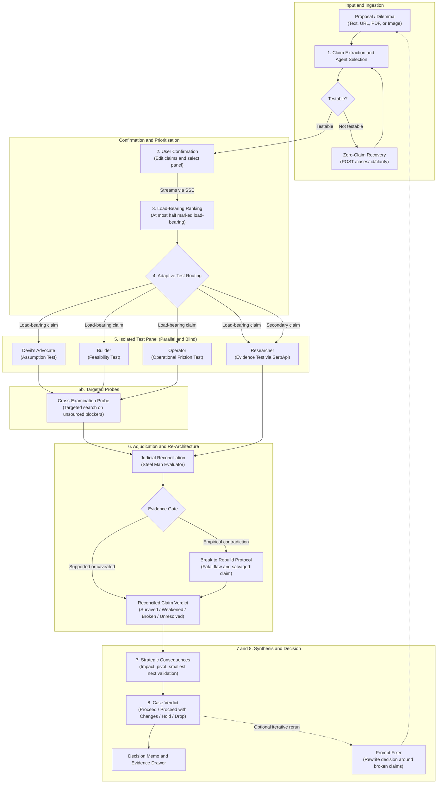
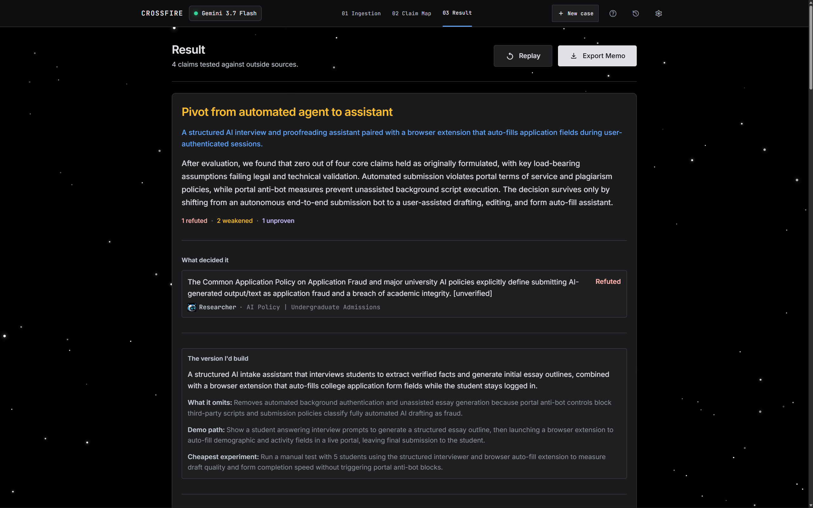

# Crossfire

[](https://serpapi.com)

Crossfire is a decision-testing engine. It takes a business, technical, or product decision you are about to commit resources to, breaks it down into the specific claims the decision depends on, tests the critical ones independently, and outputs a structured test report with a verdict per claim and concrete next steps.

> **Powered by [SerpApi](https://serpapi.com)**: Real-time search grounding and empirical evidence extraction across all stress-tested claims are powered by SerpApi. Every load-bearing assumption is cross-checked against live web results to identify unproven claims and empirical contradictions.

It is not a chatbot, an idea generator, or an advisory council. You give it a decision; it gives you back claims, tests, empirical evidence, and verdicts.


---

## Table of Contents

- [How it works](#how-it-works)
  - [1. Claim extraction, input gate, and agent selection](#1-claim-extraction-input-gate-and-agent-selection)
  - [2. Confirmation and streaming](#2-confirmation-and-streaming)
  - [3. Load-bearing ranking](#3-load-bearing-ranking)
  - [4. Adaptive test routing](#4-adaptive-test-routing)
  - [5. Isolated test panel](#5-isolated-test-panel)
  - [5b. Cross-examination probes](#5b-cross-examination-probes)
  - [6. Judicial reconciliation & Steel Man Re-Architecture](#6-judicial-reconciliation--steel-man-re-architecture)
  - [7. Strategic consequences](#7-strategic-consequences)
  - [8. Case verdict](#8-case-verdict)
- [Providers, keys, and model fallback](#providers-keys-and-model-fallback)
- [Persistence and telemetry](#persistence-and-telemetry)
- [Verdict states](#verdict-states)
- [Core doubts](#core-doubts)
  - [Isn't this just a wrapper around an AI model?](#isnt-this-just-a-wrapper-around-an-ai-model)
  - [How is this better than just using one AI model directly?](#how-is-this-better-than-just-using-one-ai-model-directly)
  - [What stops the different tests from just agreeing with each other?](#what-stops-the-different-tests-from-just-agreeing-with-each-other)
- [Getting started](#getting-started)
  - [Prerequisites](#prerequisites)
  - [Out-of-the-Box Quick Start (Zero API Keys Needed)](#out-of-the-box-quick-start-zero-api-keys-needed)
  - [One-Click Launch (All Three Services in Order)](#one-click-launch-all-three-services-in-order)
  - [Run with Docker](#run-with-docker)
  - [Manual Step-by-Step Setup](#manual-step-by-step-setup)
  - [Running tests](#4-running-tests)
- [Additional questions](#additional-questions)
- [API surface](#api-surface)
- [Repository layout](#repository-layout)
- [Configuration options](#configuration-options)

---

## How it works

When you submit a proposal or decision dilemma, Crossfire runs it through a fixed pipeline:



### 1. Claim extraction, input gate, and agent selection
Crossfire parses your input into up to five discrete, checkable claims. Input can be typed directly or ingested from a URL, PDF, or image.

If the input is not testable, Crossfire does not manufacture claims out of it. Instead of a generic redirect, the case comes back with a **zero-claim recovery**: one clarifying question written against what you actually typed, two or three fragments naming what is missing (the option, the cost, the deadline, the alternative), how the input is currently being read, and up to three *provisional* claims — each traceable to your own words, with no invented numbers, dates, prices, vendors, or jurisdictions. If nothing is inferable, the provisional list comes back empty rather than fabricated.

Answering sends `POST /cases/{id}/clarify`, which merges the answer into the original input and re-extracts. A second round asks about something different rather than repeating itself. When re-extraction succeeds, the run launches automatically instead of making you confirm twice.

The same model that reads the decision also picks which tests it needs, with a one-sentence rationale per pick. There is no keyword table: a fixed keyword map can only encode the scenarios someone thought of in advance, and identical words mean different things in different domains. You can also pin the panel manually.


### 2. Confirmation and streaming
Before running any tests or searches, the system displays the claims and the selected panel so you can edit, remove, or add. This prevents the engine from spending compute investigating misread intent.

Confirming does not block. The request returns immediately and the run continues as a background task, publishing every load-bearing flag, verdict, consequence, and progress message to the browser over Server-Sent Events as it happens.


### 3. Load-bearing ranking
A claim is load-bearing if its failure would materially change the decision. For example, in an automated compliance product, "Regulators accept automated audit trails" is load-bearing; "Users prefer weekly email digests" is not. Crossfire ranks the claims rather than flagging each in isolation, and at most half of them come back load-bearing — that is the constraint that forces prioritisation instead of treating everything as critical.

### 4. Adaptive test routing
Load-bearing claims get the full active panel. Secondary claims get a single pass, preferring the Evidence Test, because it is the only test that can return an outside source and a sourced contradiction is the only thing that can break a claim. That asymmetry is where the compute budget actually goes.

### 5. Isolated test panel
Tests run in parallel. To prevent groupthink, each executes in strict isolation: no evaluator sees what another evaluator found during the run. A test that fails outright becomes a low-confidence finding rather than taking down the run.

* **Devil's Advocate (Assumption Test):** Evaluates deductive logic, unstated premises, cognitive blind spots, and misaligned incentives without searching the web.
* **Researcher (Evidence Test):** Queries public sources and competitor documentation via SerpApi, falling back to DuckDuckGo Lite through Scrapling when no key is configured or the quota is exhausted. Results are ranked by source class (primary, institutional, press, community, blog). If initial snippets are thin on load-bearing claims, it deep-fetches candidate pages. If no public evidence exists, confidence is capped at 0.35 to avoid confident false negatives.
* **Builder (Feasibility Test):** Evaluates technical and operational viability, including required APIs, data access, latency budgets, unit economics, threat model, and regulatory boundaries (GDPR, HIPAA, SOC2).
* **Operator (Operational Friction Test):** Stress-tests the operational frictions that kill decisions after the tech works — adoption inertia, enterprise gatekeeping and procurement, regulatory liability, and process drag.


### 5b. Cross-examination probes
The Assumption and Feasibility tests do not search the web, so their hardest objections arrive as reasoning with no source behind them — and the evidence gate below would silently discount them. Before adjudication, each load-bearing claim's single strongest unsourced blocker gets one targeted search.

Blockers that assert a published rule (statute, regulation, licensing requirement) are routed to an authority-scoped query rather than the ordinary web query, so a compliance objection is answered by the body that publishes the rule instead of by a setup guide. The probe reports what the sources actually say — `contradicts`, `supports`, or `context` — not what the evaluator that raised it hoped they would say. A claim whose Evidence Test already returned a sourced contradiction is skipped; it needs no probe.

### 6. Judicial reconciliation & Steel Man Re-Architecture
Evaluators do not vote, and scores are never averaged. The **Steel Man** acts as judicial reconciler and solutions architect, reviewing the findings across all tests for each claim in parallel:

* **The Evidence Gate:** A claim can only be marked **broken** if some finding carries both empirical evidence and a contradiction traceable to a source. Reasoning alone can weaken a claim; it can never break one. An unsupported "broken" verdict is downgraded to "weakened" and the downgrade is recorded in the reasoning.
* **Break to Rebuild Protocol:** If a claim breaks or weakens, the Steel Man does not just reject the idea—it identifies the **Fatal Flaw**, constructs a **Salvaged Claim** (the minimal viable re-architecture of the assumption that preserves the core strategic upside while mitigating fatal exposure), and documents the **Trade-off Acknowledged**.


### 7. Strategic consequences
For any claim that does not cleanly survive, Crossfire synthesizes concrete recommendations:
* **Impact rating:** High, medium, or low based on whether the claim was load-bearing.
* **Strategic pivot:** A concrete operational adjustment rather than generic advice.
* **Smallest next validation:** The lowest-cost real-world experiment to de-risk remaining uncertainty before spending capital.

### 8. Case verdict
The run closes with a single decision state — **proceed**, **proceed with changes**, **hold**, or **drop** — a one-line headline, the claims sorted into survived, weakened, broken, and unproven, and two to three deduplicated next actions anchored to the specific claims that triggered them. The verdict also names a **deciding factor**: the single finding that actually moved the call, with its source, and a flag for whether the evidence gate fired there (the panel attacked but nobody could cite it).

Afterwards the memo can be exported, and the **Prompt Fixer** rewrites your original decision statement around the claims that broke or weakened, so the next run tests the re-architected version rather than the one that already failed.

Every synthesis step has a deterministic fallback. If the model fails at ranking, consequences, or the final verdict, a rule-based version ships instead. The report degrades in polish, never in existence.




---

## Providers, keys, and model fallback

Providers, API keys, and the model fallback order are managed from the UI (**Providers** modal) and stored encrypted in SQLite — they are not `.env`-only settings. Full reference: [`docs/PROVIDERS.md`](docs/PROVIDERS.md).


* **Supported providers:** local Ollama (`ollama`, default, keyless), Google Gemini, OpenAI, Anthropic, and any number of user-registered OpenAI-compatible endpoints (`POST /providers/custom` → `custom:<slug>`). Only Anthropic needs its own adapter; everything else is the OpenAI-compatible client pointed at a different base URL. No vendor SDKs.
* **Key pool:** several keys per provider, each individually enable/disable-able, sharded across concurrent calls (`KEY_POOL_MAX_INFLIGHT` in flight per key). This is what makes free-tier rate limits survivable.
* **Encryption at rest:** keys are Fernet-encrypted in the local SQLite keyring. The master key is generated at `backend/.crossfire_key` on first use, or pinned explicitly with `CROSSFIRE_SECRET_KEY`.
* **Model-level fallback chain:** each provider exposes a model list; you enable the models you want and order them. The chain is one target per enabled model, primary first, all sharing the same key pool — a model that rate-limits or errors is retried on the next enabled model without a key rotation round-trip. Retryable statuses (408/409/425/429/5xx) rotate; 401/403 are fatal and do not.
* **Provider pinning:** `catalog.LOCKED_PROVIDER` can pin execution to a single provider regardless of what's active in the UI; it's unset by default, so provider selection is free. Set it to lock the app to one provider — unpinning is one function in `providers.build_chain()`.
* **Live check:** `POST /providers/test` and `POST /providers/{id}/test` ping the configured targets so a bad key or an unreachable endpoint is visible before a run starts.

> **Security note:** the backend has no auth layer — it's designed to bind to `localhost` only, relying on that plus CORS restriction to keep the credential store private. Anything that can reach the backend can read/write provider keys. Do not expose it on a shared network or the public internet without adding an auth layer in front of it first.

---

## Persistence and telemetry

* **Cases are persisted to SQLite** (`backend/crossfire.db`, schema in [`migrations/`](migrations)), not held in memory. A backend restart mid-run does not lose the case; interrupted runs are reconciled on startup (`store.recover_interrupted_cases`).
* **The SSE stream is append-only and replayable.** Event history per case is retained, so a listener that attaches late — or reconnects — replays everything it missed before joining the live feed. No verdict is lost to a race with the browser.
* **Token telemetry per run.** Prompt/completion tokens and estimated cost are tracked per agent (extractor, load-bearing, each evaluator, cross-examination, Steel Man, synthesis), streamed as a `telemetry_ready` event, and stored on the case as `CaseTelemetry`.

---

## Verdict states

Every claim receives one of four reconciled states:

| Status | Meaning |
|---|---|
| **Survived** | The claim held under logical scrutiny and aligns with available evidence. |
| **Weakened** | The claim remains plausible but carries caveats, friction, or unmitigated risks. |
| **Broken** | The claim was refuted by empirical evidence or invalidated by a fatal blocker. |
| **Unresolved** | Evidence was conflicting or unavailable. |

`Unresolved` is an active, measured outcome of uncertainty, not a failure or disabled state. Crossfire reports when it cannot verify a claim rather than guessing or defaulting to consensus.

---

## Core doubts

### Isn't this just a wrapper around an AI model?
No. A wrapper is one prompt in, one answer out. Crossfire never lets a single model call answer the question directly. It runs a fixed process: pull out the claims, test the important ones independently (some pulling real evidence off the web), then a separate step weighs it all and decides. That's a process, not a prompt with a personality on it.

### How is this better than just using one AI model directly?
One model, one voice, one pass. What it checks depends entirely on how you phrased the question. Crossfire forces the same investigation every time: find the claims that matter, test them independently so they can't just agree with each other, back it with real evidence, and hand you a claim-by-claim verdict you can point to. A raw answer gives you none of that structure.

### What stops the different tests from just agreeing with each other?
Every test runs blind. Each one forms its own finding without seeing what the others found. Only after all of them are done does a separate step look at everything together and decide. That's what stops it turning into an echo chamber, and it's backed by real research on why AI agents debating each other tend to just agree with each other or dig into their own view.

---

## Getting started

### Prerequisites
* **Python:** 3.11 or newer
* **Node.js:** 18 or newer (with `npm`)
* An LLM endpoint (Free local Gemini-Web2API proxy, direct Gemini API key, Anthropic API key, local Ollama instance, or any OpenAI-compatible proxy)

---

### Out-of-the-Box Quick Start (Zero API Keys Needed)

Crossfire is configured to run **straight out of the box** with zero required paid API keys:
* **Search & Evidence:** Uses SerpApi when configured, with **automatic fallback to DuckDuckGo Lite** via Scrapling. If `SERPAPI_API_KEY` is not provided (or when its quota is exhausted), Crossfire seamlessly falls back to DuckDuckGo Lite with no API key or subscription needed.
* **LLM Provider:** Configured by default for local Ollama on port `11434` (`http://localhost:11434/v1`), requiring zero authentication — install [Ollama](https://ollama.com) and pull a model (e.g. `ollama pull llama3.1`). Gemini, OpenAI, and Anthropic are also fully supported with your own API key.
* **Default Ports:**
  * **Backend API:** `http://localhost:8000`
  * **Ollama:** `http://localhost:11434` (`http://localhost:11434/v1`)
  * **Frontend UI:** `http://localhost:5173`

---

### One-Click Launch (All Three Services in Order)

To install dependencies and start the entire stack together in the correct sequence with a single command:

**Windows (PowerShell):**
```powershell
# Run all three services in correct order (auto-detects missing dependencies and runs setup on first launch):
.\run_all.ps1
```

Or run the full setup explicitly beforehand:
```powershell
# Installs Python venv, backend packages, frontend npm dependencies, and initializes .env
.\setup.ps1

# Launch Backend (:8000) -> Frontend (:5173)
.\run_all.ps1
```

**macOS / Linux (bash):**
```bash
# Run all three services in correct order (auto-detects missing dependencies and runs setup on first launch):
./run_all.sh
```

Or run the full setup explicitly beforehand:
```bash
# Installs Python venv, backend packages, frontend npm dependencies, and initializes .env
./setup.sh

# Launch Backend (:8000) -> Frontend (:5173)
./run_all.sh
```

**What `run_all` handles automatically:**
1. **Crossfire Backend API (:8000):** Starts FastAPI uvicorn server in its venv and verifies `http://localhost:8000/health`.
2. **Crossfire Frontend UI (:5173):** Starts Vite dev server and verifies frontend port readiness.
3. **Browser Launch:** Automatically opens `http://localhost:5173` in your default browser.
4. **Clean Teardown:** Press **`Q`** or **`Ctrl+C`** in the launcher window to stop both services at once with zero orphaned processes or locked ports.
5. **Custom Flags:**

   | PowerShell | bash | Effect |
   |---|---|---|
   | `-NoBrowser` | `--no-browser` | Starts services without opening the browser. |
   | `-Setup` | `--setup` | Forces a full reinstall of Python & Node dependencies before launching. |
   | `-LeaveOpen` | `--leave-open` | Leaves services running in the background and exits launcher. |
   | `-BackendPort <n>` | `--backend-port=<n>` | Custom backend port (default 8000). |
   | `-FrontendPort <n>` | `--frontend-port=<n>` | Custom frontend port (default 5173). |

   On macOS/Linux, `run_all.sh` runs the backend and frontend as background jobs (not separate terminal windows); logs go to `.run_logs/backend.log` and `.run_logs/frontend.log`.

---

### Run with Docker

To run the frontend and backend using Docker Compose:

1. **Clone the repository:**
   ```bash
   git clone https://github.com/hriday-singh/crossfire.git
   cd crossfire
   ```

2. **Configure environment variables:**
   Create a `.env` file in the root directory:
   ```bash
   # Example .env
   LLM_PROVIDER=ollama
   # host.docker.internal allows the container to talk to Ollama on the host
   LLM_BASE_URL=http://host.docker.internal:11434/v1
   # SERPAPI_API_KEY= # Optional, leave blank to use DuckDuckGo
   ```

3. **Build and start the containers:**
   ```bash
   docker compose up -d --build
   ```

4. **Access the application:**
   * **Frontend UI:** `http://localhost:9125`
   * **Backend API:** `http://localhost:9126`

---

### Manual Step-by-Step Setup

If you prefer starting each service individually in separate terminals:

### 1. Clone the repository
```bash
git clone https://github.com/hriday-singh/crossfire.git
cd crossfire
```

### 2. Configure and run the backend (:8000)

```bash
cd backend

# Create and activate a Python virtual environment
# Windows (PowerShell):
python -m venv .venv
.\.venv\Scripts\Activate.ps1

# Linux / macOS:
python3 -m venv .venv
source .venv/bin/activate

# Install dependencies
pip install --upgrade pip
pip install -r requirements.txt
```

Set up your environment variables:
```bash
# Copy the template (configured out of the box for port 8000 & local Ollama)
cp .env.example .env
```

Open `backend/.env` and review your settings:

#### Option A: Local Ollama (Default out-of-the-box, no API key needed)
Install [Ollama](https://ollama.com), pull a model, then:
```env
LLM_PROVIDER=ollama
LLM_BASE_URL=http://localhost:11434/v1
LLM_MODEL=llama3.1
PORT=8000

# Leave blank to automatically use DuckDuckGo Lite with zero API keys:
SERPAPI_API_KEY=
```

#### Option B: Google Gemini API
```env
LLM_PROVIDER=gemini
GEMINI_API_KEY=your_gemini_api_key_here
LLM_MODEL=gemini-3.7-flash
PORT=8000
```

#### Option C: Anthropic Claude
```env
LLM_PROVIDER=anthropic
ANTHROPIC_API_KEY=your_anthropic_api_key_here
LLM_MODEL=claude-3-5-sonnet-latest
PORT=8000
```

> **Search & Evidence Note:** When `SERPAPI_API_KEY` is provided, Crossfire retrieves structured Google search results via SerpApi. If `SERPAPI_API_KEY` is empty, missing, or rate-limited, Crossfire automatically and seamlessly falls back to **DuckDuckGo Lite** using an asynchronous scraper. Evidence retrieval works completely out of the box with no paid subscription.

Start the backend server on default port 8000:
```bash
uvicorn main:app --reload --port 8000
# Or run directly:
python main.py
```
Verify the backend is running by visiting `http://localhost:8000/health`.

### 3. Configure and run the frontend (:5173)

In a new terminal window:
```bash
cd frontend

# Install Node dependencies
npm install

# Start the development server
npm run dev
```

The frontend will be available at `http://localhost:5173`. Vite is configured to proxy API requests (`/cases`, `/ingest`, `/providers`, `/health`, `/ready`) directly to the backend on port 8000.

### 4. Running tests

#### Backend tests
Run unit and integration tests with pytest:
```bash
cd backend
pytest
```

#### Frontend tests
Run unit tests and TypeScript type checks:
```bash
cd frontend
npm run test:all
```

---

## Additional questions

### What is Crossfire, in one line?
It takes a decision you're about to commit to, breaks it into the claims it depends on, tests the important ones independently, and gives you a verdict per claim: survived, weakened, broken, or unresolved, plus what to do next. Not a chat, not an opinion, a test report.

### How is this not just an AI assistant or chatbot?
An assistant chats with you and answers whatever you ask. Crossfire doesn't converse. You give it one decision, it gives you back claims, tests, evidence, and verdicts. No persona, no back and forth. Closer to a test report than a conversation.

### How is this better than someone writing a really good prompt themselves?
A good prompt is only as good as the person who wrote it, that one time. Ask it differently, or forget to ask about the thing that matters, and you get nothing. Crossfire runs the same process every time regardless: find what actually matters, test it independently, back it with evidence, give a verdict. It doesn't rely on you knowing what to ask.

### How is this different from just using Claude or ChatGPT with search turned on?
Search-enabled chat still reasons in one continuous thread. Once it finds something that fits the answer it's already building, it tends to keep building on it. Crossfire runs separate, independent checks that can't see each other's results until a final step weighs the evidence, actively looks for what argues against a claim and not just what supports it, and is honest when it genuinely can't tell, unresolved is a real answer, not a cop-out. You get a structured verdict, not a paragraph.

### How is this different from a research platform, like Perplexity?
A research platform tells you what's out there on a topic. Crossfire tells you whether your specific decision survives. It doesn't just gather information, it decides which claims in your plan actually matter, tests those, and ends with a verdict and a next step, not a report you still have to interpret yourself.

### How is this different from an AI council, like The AI Council app?
Those tools send your question to several models, let them see and react to each other's answers, then merge everything into one final answer with a single confidence score. That's still one opinion at the end, just an averaged one, and letting the models see each other's answers before merging is exactly what makes them converge and agree instead of catching what the other missed. Crossfire never merges into one answer or one score. It decides which claims your decision actually depends on, tests each one independently with zero visibility into what the others found, and gives you a verdict per claim, survived, weakened, broken, or unresolved, plus what that means for your decision and what to check next. A confidence score tells you how much agreement there was. A verdict tells you what to actually do.

---

## API surface

| Method | Path | Purpose |
|---|---|---|
| `POST` | `/cases` | Extract claims and select the panel; returns `awaiting_confirmation` or `needs_input` |
| `POST` | `/cases/{id}/clarify` | Answer a zero-claim recovery question; re-extracts and auto-launches on success |
| `POST` | `/cases/{id}/confirm` | Lock claims and schedule the run; `202 Accepted` in <50ms |
| `GET` | `/cases/{id}/stream` | SSE stream (replays history, then live events) |
| `GET` | `/cases/{id}` | Full hydrated case for the memo and evidence drawer |
| `POST` | `/cases/{id}/improve_prompt` | Prompt Fixer: rewrite the decision around the claims that broke |
| `POST` | `/ingest/url` · `/ingest/pdf` · `/ingest/image` · `/ingest/markdown` | Produce the `context` field from an external source |
| `POST` | `/baseline` | Single-prompt control answer for side-by-side comparison |
| `GET` | `/health` · `/ready` | Liveness and readiness |
| `GET`/`PUT` | `/providers`, `/providers/active`, `/providers/fallback` | Read providers; set the active provider and fallback order |
| `PUT` | `/providers/{id}/models` · `/providers/{id}/config` | Enable/order models; edit base URL and model for editable providers |
| `POST`/`DELETE` | `/providers/custom` · `/providers/{id}` | Register or remove an OpenAI-compatible endpoint |
| `GET`/`POST`/`PATCH`/`DELETE` | `/providers/{id}/keys`, `/providers/keys/{key_id}` | Manage the encrypted key pool |
| `POST` | `/providers/test` · `/providers/{id}/test` | Ping configured targets |
| `GET` | `/providers/pool/status` · `/providers/ollama/models` | Key-pool state; discovered local Ollama models |

SSE event names: `claim_map_ready`, `needs_input`, `load_bearing_ready`, `test_started`, `finding_ready`, `verdict_ready`, `consequence_ready`, `case_verdict`, `telemetry_ready`, `activity`, `run_complete`, `error`.

---

## Repository layout

```
crossfire/
├── backend/
│   ├── api/
│   │   ├── routes.py          # Case lifecycle, clarify, ingestion, baseline, prompt fixer
│   │   ├── provider_routes.py # Provider/key/model management endpoints
│   │   └── schemas.py         # Request and response models
│   ├── core/
│   │   ├── evaluators/        # Devil's Advocate, Researcher (SerpApi), Builder, and Operator runners
│   │   ├── agent_panel.py     # Agent catalog, failure-mode routing, and test-plan construction
│   │   ├── loop.py            # Pipeline orchestrator: extraction, ranking, evaluation, run_pipeline
│   │   ├── recovery.py        # Zero-claim recovery: clarifying question + provisional claims
│   │   ├── cross_examination.py # Phase 1.5 targeted probes for unsourced blockers
│   │   ├── reconcile.py       # Steel Man: per-claim reconciliation, evidence gate, Break to Rebuild
│   │   ├── synthesis.py       # Consequences, deciding factor, decision state, case verdict
│   │   ├── reformulate.py     # Prompt Fixer: rewrites the decision around broken claims
│   │   ├── activity.py        # Narration events emitted during a run
│   │   ├── telemetry.py       # Per-agent token and cost accounting
│   │   ├── baseline.py        # Single-prompt control answer for side-by-side comparison
│   │   └── models.py          # Pydantic data contracts (Case, Claim, Finding, CaseVerdict)
│   ├── providers/
│   │   ├── catalog.py         # Provider specs, model lists, custom-endpoint slugs, LOCKED_PROVIDER
│   │   ├── keyring.py         # Encrypted key/config store (SQLite + Fernet)
│   │   ├── pool.py            # Key pool with per-key in-flight limits
│   │   ├── routing.py         # Fallback chain execution and retry classification
│   │   └── {gemini,anthropic,openai_compat}.py  # Wire-level adapters
│   ├── evidence/              # SerpApi + Scrapling search, deep-fetch, and snippet curation
│   ├── ingestion/             # PDF, image (OCR), URL, and markdown ingestion
│   ├── events.py              # Per-case append-only SSE history and multi-subscriber queues
│   ├── store.py               # SQLite case persistence and interrupted-run recovery
│   ├── config.py              # Environment settings and validation
│   ├── progress.py            # Project progress report generator
│   └── main.py                # FastAPI application entry point
├── frontend/
│   ├── src/
│   │   ├── components/
│   │   │   ├── screens/       # Entry, Confirm, Dashboard
│   │   │   ├── features/      # Claim cards, Evidence drawer, activity feed, Providers/Settings/History modals
│   │   │   ├── canvas/        # Starfield, sprites, and stage scenery
│   │   │   ├── layout/        # Header and error banner
│   │   │   └── ui/            # Shared primitives (button, card, sheet, dialog, provider icons)
│   │   ├── context/           # Case reducer, SSE reducer helpers, and state provider
│   │   ├── hooks/             # SSE stream and live-bridge hooks
│   │   ├── lib/               # API clients, formatters, memo export, FAQ and preset content
│   │   └── tests/             # Vitest component, hook, and reducer tests
│   ├── TESTING.md             # Frontend testing standards (mandatory for frontend changes)
│   ├── package.json
│   └── vite.config.ts         # Vite configuration with backend proxy
├── migrations/                # SQL migration files (generated, never auto-applied)
├── docs/                      # Architecture specifications, provider reference, implementation records
└── README.md
```

---

## Configuration options

The backend can be configured via environment variables in `backend/.env`:

| Variable | Default | Description |
|---|---|---|
| `PORT` | `8000` | Default HTTP port for the FastAPI backend |
| `LLM_PROVIDER` | `ollama` | Provider backend: `ollama`, `gemini`, `anthropic`, or `openai` |
| `LLM_BASE_URL` | `http://localhost:11434/v1` | Base URL used when `LLM_PROVIDER=ollama` (or any other OpenAI-compatible endpoint) |
| `LLM_MODEL` | `llama3.1` | Model identifier passed to the active provider |
| `SERPAPI_API_KEY` | `""` | Optional SerpApi key for Google Search; when omitted or quota exhausted, automatically falls back to DuckDuckGo Lite with zero keys needed |
| `LLM_API_KEY` | `""` | Optional universal API key override |
| `EVALUATOR_CONCURRENCY` | `8` | Maximum concurrent evaluator calls during the test stage |
| `EVALUATOR_TIMEOUT_SECONDS` | `60.0` | Timeout per evaluator call before marking a test timed out |
| `LLM_TIMEOUT_SECONDS` | `90.0` | Timeout for any single provider call |
| `STEELMAN_CONCURRENCY` | `3` | Maximum concurrent Steel Man reconciliations |
| `GEMINI_API_KEYS` | `""` | Comma-separated Gemini keys, sharded across concurrent calls by the key pool |
| `KEY_POOL_MAX_INFLIGHT` | `2` | Concurrent in-flight requests allowed per key |
| `CROSSFIRE_SECRET_KEY` | *(generated)* | Fernet master key for the encrypted keyring. Blank generates `backend/.crossfire_key` on first use |
| `SEARCH_PROVIDER` | `duckduckgo` | Preferred search backend; SerpApi is used when `SERPAPI_API_KEY` is set |
| `CURATION_LLM_MODEL` | `gemini-3.7-flash` | Model used for evidence snippet curation |
| `USE_LLM_CURATION` | `false` | When `true`, curates evidence snippets with an LLM pass instead of the deterministic curator |
| `CORS_ALLOWED_ORIGINS` | `localhost:5173, 127.0.0.1:5173, localhost:3000` | Comma-separated (or JSON list) allowed browser origins |
| `ANTHROPIC_API_KEY` / `OPENAI_API_KEY` | `""` | Seed the encrypted keyring on a fresh machine. Keys are normally entered in the UI (Providers modal), not here |
| `DEMO_MODE` | `false` | When `true`, returns canned fixtures for offline testing |

> Provider selection, per-provider keys, enabled models, and the fallback order are stored in the encrypted keyring and edited from the **Providers** modal in the UI. The `LLM_*` variables above are the bootstrap defaults used before anything is configured there.
