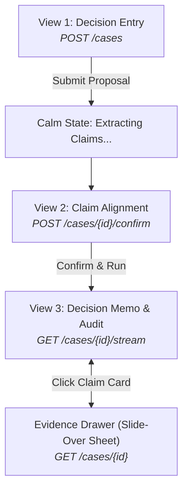

# Crossfire — Frontend View Architecture & Screen Plan

This document outlines the complete view architecture for **Crossfire** from a frontend/UI developer's perspective. It strictly reflects the **currently working backend API** (`backend/api/routes.py`, `backend/core/models.py`, `backend/api/events.py`) and embodies our core UI philosophy: **maximum readability, zero clutter, and zero fake telemetry**.

---

## 1. Goal Description & Philosophy

Crossfire is a **rigorous decision testing memo**, not an AI chatbot, a simulated hacker terminal, or an arcade dashboard. 

Instead of an unreadable, cluttered console or an agreeable AI chat window:
1. **Inputs a proposal or business decision** via a clean, distraction-free prompt.
2. **Extracts foundational assumptions** into distinct, testable claims.
3. **Lets the user review and edit claims** before any compute runs.
4. **Stress-tests each claim** against live web evidence, counter-arguments, and feasibility constraints.
5. **Presents an authoritative, readable Decision Memo** with clear verdicts (`survived`, `weakened`, `broken`, `unresolved`) and a 1-click slide-over Evidence Drawer containing real citations.

Our mandate: **Clean, breathable, honest, and effortless to read.**

---

## 2. Core View Flow (The User Journey)

The entire product consists of three focused screens and one slide-over drawer:



---

## 3. Detailed View Breakdown

### View 1: Decision Entry View ("What are you considering?")
*The distraction-free starting point.*

* **Role & Purpose:** A focused, high-contrast entry point that invites the user to state a business proposition, product bet, or strategic dilemma.
* **Layout & Key Elements:**
  * **Header:** Minimal wordmark (`Crossfire`) with generous breathing room.
  * **Hero Prompt:** A clear, human question: *"What are you considering?"*
  * **Textarea:** Clean, auto-expanding textarea with a subtle light border and comfortable font size (16px / `text-base` to prevent mobile zooming, with relaxed line height).
  * **Primary Action:** A single high-contrast button: `"Test Decision"`.
* **Honest Simplicity (No Fake Stuff):**
  * No fake PDF dropzones or file attachment widgets.
  * No model provider dropdowns, temperature sliders, or settings modals.
  * No cycling example carousels or decorative graphics.
* **Extraction State:**
  * On submit, calls `POST /cases` (`{"raw_input": "..."}`).
  * Transitions smoothly to a calm skeleton state with 3–4 soft pulsing lines and a quiet caption: *"Extracting core assumptions..."*. No fake percentage spinners.

---

### View 2: Claim Alignment View
*The checkpoint where user and system align on what is actually being tested.*

* **Role & Purpose:** Maps to `Case.status == "awaiting_confirmation"`. Ensures the system didn't misunderstand the user's premise before compute runs.
* **Layout & Key Elements:**
  * **Header Restatement:** Echoes the decision in clean, readable prose so the user knows Crossfire understood their intent.
  * **Instructions:** *"We extracted these core assumptions. Verify, edit, or remove any before we test."*
  * **Claim List:** A clean stack of white cards against the warm-white background.
  * **Inline Editing:** Clicking any card switches the statement to an editable text input.
  * **Delete Affordance:** A simple `(×)` remove button on each card.
  * **Add Affordance:** A lightweight `"+ Add assumption"` text button for anything the system missed.
  * **Primary Action:** One clear button: `"Confirm and test assumptions"` $\rightarrow$ `POST /cases/{id}/confirm`.
* **Design Character:** A calm, static editing form.

---

### View 3: Decision Memo & Live Audit (Testing $\rightarrow$ Completed)
*The signature screen: a unified, calm executive brief that seamlessly updates.*

* **Role & Purpose:** Subscribes to `GET /cases/{id}/stream` when `status == "testing"` and remains the persistent results memo once `status == "done"`. Avoids jarring route navigations.
* **Layout & Key Elements:**
  * **Executive Summary Header:**
    * *During testing:* A truthful, quiet status line: *"Testing 4 claims against web evidence and counterarguments..."*
    * *When complete:* A calm, authoritative summary: *"4 claims tested: 1 survived, 1 weakened, 1 broken, 1 unresolved."*
    * *No fake telemetry:* No glowing blue "LIVE STREAM" dots, no radar beacons, no simulated counters.
  * **Claim Cards:**
    * Clean, well-spaced cards (16px padding, soft border, generous margins).
    * **Load-bearing Indicator:** Subtle badge or label: *"Core foundation"* (for claims where `load_bearing == true`).
    * **Claim Statement:** Bold, high-contrast, easily scannable.
    * **Verdict Badge (Strict Color Mapping):**
      * `survived`: Emerald badge (`#059669` text on `#ecfdf5`).
      * `weakened`: Amber badge (`#d97706` text on `#fffbeb`).
      * `broken`: Rose badge (`#e11d48` text on `#fff1f2`).
      * `unresolved`: Indigo badge (`#4f46e5` text on `#eef2ff`) — *represents a deliberate, measured uncertainty, never gray or disabled.*
    * **Decision Consequence:** Plain-English explanation of the real-world impact (e.g., *"Customer acquisition costs will double if this assumption fails"*).
    * **Action Trigger:** A clear, visible button: `"View Evidence & Sources →"` that opens the Evidence Drawer.

---

### Slide-Over Drawer: Evidence & Source Audit
*The transparency layer: inspect the real proof behind every verdict.*

* **Role & Purpose:** A right-hand slide-over sheet (`Sheet` primitive) opening smoothly without navigating away from the memo. Fetches or reads the full `Case` object (`GET /cases/{id}`).
* **Layout & Key Elements (Top to Bottom):**
  1. **Claim Statement:** Full, prominent statement.
  2. **Verdict & Reasoning:** The verdict badge and the evaluator's plain-language reasoning.
  3. **Real Evidence Sources (`EvidenceItem` list):**
     * Clickable primary source URL with clean domain label.
     * Source title.
     * Curated quote/snippet retrieved by Tavily / Scrapling.
     * *Honest Empty State:* If web evidence was absent, an explicit, truthful callout: *"No public evidence could be retrieved for this claim"*.
  4. **Contradictions:** Explicit counterarguments or conflicting data found, if any.
  5. **Recommended Change:** Actionable guidance on how to adjust your decision or business plan.
  6. **Next Validation Step:** The smallest concrete real-world test to perform (rendered when present).

---

### View 4: Error Handling
*Clear, non-destructive feedback.*

* **Test-Level Failure:** If an evaluator error occurs on a single test, only that claim indicates an issue; the rest of the memo finishes cleanly.
* **Pipeline-Level Failure:** A clean alert banner at the top of the memo explaining the issue in plain English, with a retry option.

---

## 4. UI Component Architecture

Streamlined, lightweight, and built purely with standard React + Tailwind + Radix UI:

```
frontend/src/
├── components/
│   ├── ui/                       # Radix / shadcn primitives (Button, Textarea, Card, Sheet, Badge, Alert)
│   ├── layout/
│   │   ├── Header.tsx            # Clean wordmark and connection state text
│   │   └── Container.tsx         # Centered container with generous reading width (max-w-4xl)
│   ├── screens/
│   │   ├── EntryScreen.tsx       # View 1: Decision input
│   │   ├── ConfirmScreen.tsx     # View 2: Claim alignment checklist
│   │   └── DashboardScreen.tsx   # View 3: Unified memo & live audit
│   ├── features/
│   │   ├── ClaimCard.tsx         # Readable card with verdict badge & consequence
│   │   ├── VerdictBadge.tsx      # Semantic badge (survived, weakened, broken, unresolved)
│   │   ├── EvidenceDrawer.tsx    # Slide-over audit sheet
│   │   └── EvidenceSourceItem.tsx# Real citation link and snippet
```

---

## 5. Design Tokens & Styling Rules

* **Theme:** Light-first default (warm white `#fafafa` canvas, pure white `#ffffff` cards, soft neutral `#e4e4e7` borders).
* **Typography:** System sans-serif (`Inter`, system-ui) with relaxed line height (`leading-relaxed`) and deep charcoal text (`#18181b`) for optimal readability.
* **Verdict Colors:** Reserved strictly for claim verdicts—never used for form validation or decorative badges.
* **Masking Evaluators:** Internal agent names (`devils_advocate`, `receipts`, `builder`) **never appear in the UI**. Only user-facing test types (*Assumption Test*, *Evidence Test*, *Feasibility Test*) are displayed.
