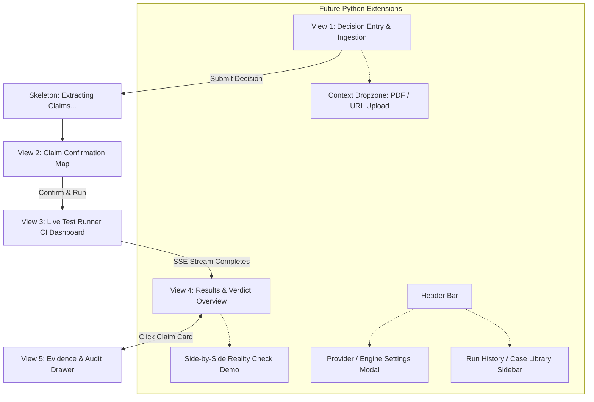

# Crossfire — Frontend View Architecture & Screen Plan

This document outlines the complete view architecture for **Crossfire** from a frontend/UI developer's perspective. It explains what screens, drawers, and modal views the application needs to deliver the core experience, and how upcoming Python backend features (file/URL ingestion, multi-model selection, side-by-side comparison, and case history) integrate smoothly into the UI.

---

## 1. Goal Description

Crossfire is not a conversational chatbot or a generic AI council; **it is a crash-test rig for high-stakes decisions**. 

Instead of an AI chat window that flatters the user, Crossfire behaves like a **developer CI/CD test runner** (think GitHub Actions or Vercel deployment dashboards):
1. Takes a proposal or business decision.
2. Extracts its core assumptions into distinct "claims".
3. Lets the user verify or adjust those claims before testing starts.
4. Stress-tests each claim against real web evidence and counterarguments.
5. Surfaces clean verdicts (`survived`, `weakened`, `broken`, `unresolved`) alongside concrete next validation actions.

Our job as UI developers is to make this process feel fast, authoritative, dense, and honest—grounded in structured data rather than chat transcripts.

---

## 2. Core View Flow (The User Journey)

Below is the user flow across the primary views:



---

## 3. Detailed View Breakdown (UI Developer Perspective)

### View 1: Decision Entry View ("What are you considering?")
*The landing state where the user presents their idea or decision.*

* **Role & Purpose:** A distraction-free entry point. It invites the user to state a business proposition, product bet, or strategic dilemma.
* **Layout & Key Elements:**
  * **Hero Input Area:** An auto-expanding textarea with a prominent prompt: *"What are you considering?"*
  * **Rotating Subtle Placeholders:** 2–3 realistic examples cycling quietly (e.g., *"I want to offer a free tier with unlimited AI queries"*, *"We should build a mobile-first college admissions agent"*).
  * **Primary Action:** A single high-contrast button: `"Test this"`.
  * **Context / Ingestion Area (Future Python Feature):**
    * A subtle toggle or drag-and-drop zone: *"Attach background document (PDF) or link (URL)"*.
    * Once Python's `ingestion/pdf.py` and Scrapling URL scrapers are active, this allows users to upload full pitch decks, whitepapers, or landing pages as supporting context.
* **Loading State (Extracting Claims):**
  * When submitted, the input morphs into a sleek skeleton placeholder (3–4 pulsing bars) with the caption *"Breaking this into claims..."*. No fake spinners or percentage gauges.

---

### View 2: Claim Map Confirmation View
*The checkpoint where the user and the system align on what is actually being tested.*

* **Role & Purpose:** Before wasting compute running web searches and evaluator models, Crossfire presents the extracted assumptions. This ensures the system didn't misunderstand the user's premise.
* **Layout & Key Elements:**
  * **Header Echo:** A clean paraphrase of the user’s input so they know the AI grasped their intent.
  * **Claim List (Card Stack):** A stack of compact cards, each containing an individual claim statement.
  * **Inline Editing:** Clicking a card turns its text into an editable input box; an `(x)` button allows deleting irrelevant assumptions.
  * **Add Claim Affordance:** A lightweight `"+ Add assumption"` text button for anything the AI missed.
  * **Primary Action:** A prominent button: `"Confirm and run tests"`.
* **Design Note:** This is an intentionally calm, static form—the only screen in the app that feels like editing rather than watching a machine run.

---

### View 3: Live Test Runner View (The CI Dashboard)
*The signature screen that watches real tests execute in real time.*

* **Role & Purpose:** Visually mirrors a modern continuous-integration (CI) test suite. Claims are the test suites; individual evaluations are the test jobs.
* **Layout & Key Elements:**
  * **Live Stream Header:**
    * A gentle pulsing connection dot (indicating the Server-Sent Events stream is healthy).
    * Summary counter: *"4 of 4 claims queued for testing"*.
  * **Test Job Matrix (Grouped by Claim):**
    * Each claim forms a group. Inside each group are its assigned tests:
      * **Assumption Test** (evaluates foundational logic)
      * **Evidence Test** (searches the web for verifiable facts/competitors)
      * **Feasibility Test** (evaluates implementation realism)
      * **Edge-Case Test** (uncovers boundary failures)
    * **Row States:**
      * *Queued:* Muted text, dashed circle icon.
      * *Running:* Active subtle pulse/spin, highlighted row background.
      * *Finding Attached:* Sub-row appears with a 1-line summary and confidence meter.
      * *Resolved:* Badge transitions directly to its final verdict.

---

### View 4: Results & Verdict Dashboard
*The post-run executive summary once all tests finish.*

* **Role & Purpose:** The high-level verdict screen. It tells the user which parts of their idea survived, which were damaged, which broke completely, and what is still uncertain.
* **Layout & Key Elements:**
  * **Header Scoreboard:**
    * A permanent summary banner: e.g., *"4 of 4 claims tested: 1 survived, 1 weakened, 1 broken, 1 unresolved"*.
  * **Prioritized Claim Cards:**
    * Sorted by importance: **Load-bearing claims first** (marked with an anchor/flag icon: *"If this is false, the decision falls apart"*), then by severity (Broken $\rightarrow$ Unresolved $\rightarrow$ Weakened $\rightarrow$ Survived).
    * Each card displays:
      * Claim statement.
      * Verdict Badge:
        * 🟢 **Survived** (green, checkmark)
        * 🟡 **Weakened** (amber, alert triangle)
        * 🔴 **Broken** (red, cross icon)
        * 🟣 **Unresolved** (violet/indigo, help circle — *indicates the system checked and found conflicting/thin evidence, not an error!*)
      * Impact Indicator (a discreet 3-bar intensity meter: High / Medium / Low).
      * One-line decision update excerpt.
    * **Primary Interaction:** Clicking any card smoothly slides open the **Evidence Drawer**.

---

### View 5: Evidence & Audit Slide-Over Drawer (The Deep Dive Sheet)
*The transparency layer: why the system made its call and what you should do next.*

* **Role & Purpose:** A right-hand slide-over panel (Sheet) that opens without navigating away from the dashboard. This contains the proof behind every verdict.
* **Layout & Key Elements (Top to Bottom):**
  1. **Claim Statement:** The full text of the claim.
  2. **Why It Matters:** Plain-English explanation of why this claim is load-bearing to the whole decision.
  3. **Tests Run:** List of tests executed with their individual results.
  4. **Evidence Found:** Web sources retrieved (clickable title, URL link, curated snippet). If web searches yielded nothing, an honest callout: *"No public evidence could be retrieved"*.
  5. **Contradictions:** Any counter-evidence or nuances that push against the finding.
  6. **Verdict & Adjudication Reasoning:** How the final status was reconciled.
  7. **Decision Impact & What Changes:** Actionable guidance on how to adjust your plan.
  8. **Next Validation Step:** The single smallest real-world test you can run tomorrow to remove remaining doubt (e.g., *"Run a 10-person landing page test on price sensitivity"*).

---

### View 6: Error & Edge-Case Views
*Clear, non-destructive failure handling.*

* **Row-Level Test Failures:** If a single test or search query fails, only that specific row flags a warning; other tests and claims complete normally.
* **System/Pipeline Failure:** A top banner with plain-language feedback and a collapsible drawer for technical diagnostics.
* **Stream Disconnection Notice:** If the SSE stream drops, the "live" indicator changes from pulsing blue to amber, letting the user reconnect without losing progress.

---

### Future Python Feature Views (Extensions & Power Tools)

These views support the backend capabilities slated for upcoming hours and phases:

#### View 7: Side-by-Side "Reality Check" Demo View
* **Why it exists:** Demonstrates the core value proposition for pitch/demo audiences.
* **Layout:** A split-screen 2-column view:
  * **Left Column ("Standard AI Assistant"):** Shows the polite, agreeable, generic response you get from asking standard ChatGPT/Claude/Gemini: *"That sounds like a wonderful startup idea! Here are 5 ways to succeed..."*
  * **Right Column ("Crossfire Crash Test"):** The structured Crossfire breakdown highlighting the broken assumption and competitor evidence that invalidates the premise.

#### View 8: Provider & Engine Configuration Modal
* **Why it exists:** Crossfire's backend supports swapping models (Gemini, Claude, GPT-4o, Local Ollama).
* **Layout:** A clean modal dialog accessible via a settings gear icon in the header:
  * Dropdown selector for active LLM engine.
  * Local model host configuration (e.g., pointing to `http://localhost:11434` for Ollama).
  * API Key status indicators.

#### View 9: Case History & Run Library Drawer
* **Why it exists:** Once persistence is enabled in Python (`store.py`), users can revisit past crash tests.
* **Layout:** A slide-out left sidebar showing past runs, timestamps, input summaries, and verdict ratios, enabling users to test "Idea Revision 2" and compare it with "Idea Revision 1".

---

## 4. UI Architecture & Component Hierarchy

To keep the UI clean, maintainable, and aligned with standard component libraries (React + Tailwind + shadcn/ui):

```
apps/web (or frontend/src)
├── components/
│   ├── ui/                       # Radix UI primitives (Button, Textarea, Card, Sheet, Badge, Alert)
│   ├── layout/
│   │   ├── Header.tsx            # Logo, SSE connection status dot, Settings trigger
│   │   └── Shell.tsx             # Central constrained container (max-w-5xl)
│   ├── entry/
│   │   ├── DecisionInput.tsx     # Hero prompt & auto-growing textarea
│   │   └── IngestionDropzone.tsx # Future PDF / URL upload zone
│   ├── confirmation/
│   │   ├── ClaimMapList.tsx      # Editable list of extracted claims
│   │   └── ClaimEditCard.tsx     # Single editable claim card
│   ├── runner/
│   │   ├── LiveCounterBanner.tsx # "N of M claims tested..."
│   │   ├── TestMatrix.tsx        # CI-style list grouped by claim
│   │   └── TestJobRow.tsx        # Individual test state row (queued, running, resolved)
│   ├── dashboard/
│   │   ├── VerdictScoreboard.tsx # Final summary metrics
│   │   ├── ClaimCard.tsx         # Prioritized card with verdict badge & impact meter
│   │   └── ImpactMeter.tsx       # 3-segment bar visual
│   ├── drawer/
│   │   ├── EvidenceDrawer.tsx    # Slide-over Sheet (Claim -> Evidence -> Decision Consequence)
│   │   └── SourceLink.tsx        # Web citation snippet card
│   ├── demo/
│   │   └── SideBySideView.tsx    # Split comparison view (Standard AI vs Crossfire)
│   └── settings/
│       └── ProviderModal.tsx     # Model provider / API settings
```

---

## 5. Design Tokens & Styling Rules

* **Theme:** Dark mode by default (dark slate / zinc-950 base) with monospace accents for IDs, test labels, and URLs.
* **Verdict Color Role Exclusivity:**
  * 🟢 **Survived:** Emerald (`#34d399`)
  * 🟡 **Weakened:** Amber (`#fbbf24`)
  * 🔴 **Broken:** Red (`#f87171`)
  * 🟣 **Unresolved:** Violet (`#a78bfa`) — *Deliberately distinct from gray so it never looks disabled or missed.*
* **Rule on Evaluator Names:** Internal Python worker names (`devils_advocate`, `receipts`, `builder`) are strictly mapped to user-facing test labels (*Assumption Test*, *Evidence Test*, *Feasibility Test*) and never exposed in the interface.

---

## 6. Key Architectural Alignments

1. **Single View vs Two Routes for Testing & Results:** We recommend making the **Live Test Runner (View 3)** and **Results Dashboard (View 4)** the same screen component. As tests finish, the rows seamlessly transition into their completed cards rather than triggering a disruptive full-page navigation.
2. **Entry Screen Simplicity:** We keep the entry screen strictly to one text box (no tab switchers or mode pickers), with the document/URL upload nestled cleanly underneath as an optional attachment.
3. **Side-by-Side View Scope:** The side-by-side comparison (View 7) will exist as a dedicated presentation route (e.g., `/demo`) rather than cluttering the primary user workflow.
